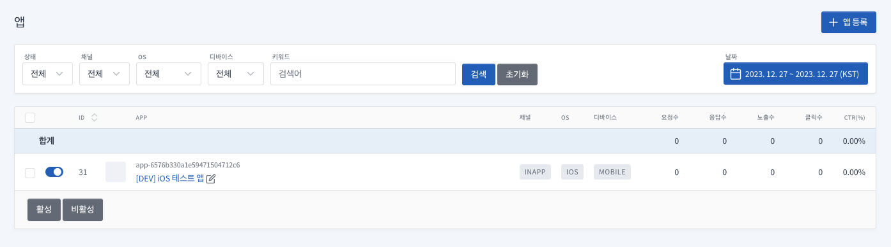
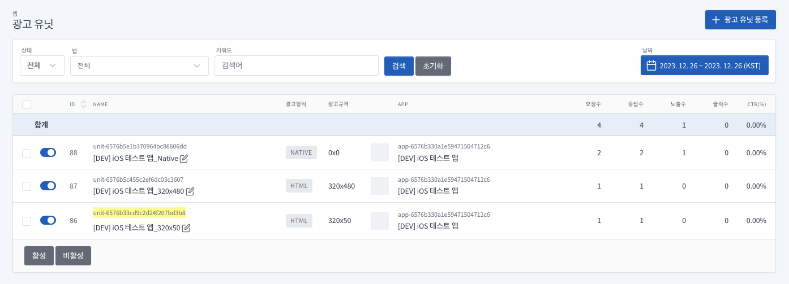

# SANTA SDK for Swift

Swift 가이드입니다.  
ObjectiveC 가이드는 [README_ObjectiveC](./README_ObjectiveC.md)를 참고해주세요.

목차
===

- [Version History](#version-history)
- [시작하기 전에](#시작하기-전에)
    - [SDK 정보](#sdk-정보)
- [시작하기](#시작하기)
- [어플리케이션 설정](#어플리케이션-설정)
  - [Santa SDK 추가하기](#santa-sdk-추가하기-for-cocoapods)
  - [Info.plist 설정](#infoplist-설정)
- [광고 적용하기](#광고-적용하기)
  - [앱 등록](#앱-등록)
  - [유닛 ID 발급](#유닛-ID-발급)
  - [배너 광고](#배너-광고)
  - [전면 광고](#전면-광고)
  - [네이티브 광고](#네이티브-광고)
- [광고 인스턴스 추가 옵션](#광고-인스턴스-추가-옵션)

# Version History

- Version 1.0.2
  - 위치 정보 제거

- Version 1.0.1
  - ObjectiveC 호환성 추가

- Version 1.0.0


# 시작하기 전에

- Santa SDK에서는 광고 요청에 대한 응답 후 노출까지의 시간(노출 캐시 시간)을 10분 이내로 권장합니다 (IAB 권장).
- 광고 응답 이후 노출 시간 차이가 해당 시간보다 길어지면 광고 캠페인에 따라서 노출이 무효 처리될 수 있습니다.


# SDK 정보

SantaSDK는 Xcode 15.1, iOS 12.0 버전으로 빌드되었습니다.  

- 참조 1: [App Store 제출을 위한 SDK 최소 요구 사항 보기](https://developer.apple.com/kr/news/upcoming-requirements)   
- 참조 2: [최소 요구 사항 및 지원되는 SDK](https://developer.apple.com/kr/support/xcode)

# 시작하기

## 어플리케이션 설정

### Santa SDK 추가하기 for CocoaPods

**[Cocoapods 설치 가이드](https://guides.cocoapods.org/using/getting-started.html)**

#### POD Install

Podfile 만들기
```
pod init
```
or 
```
vi Podfile
```

Podfile 수정
```
target 'MyApp' do
  use_frameworks!
  
  pod 'SantaSDK'
end
```

Podfile 설치
```
pod install
```

### Info.plist 설정

| Key                                                          | Required | Value                                    | Description                 |
|--------------------------------------------------------------|----------|------------------------------------------|-----------------------------|
| Privacy - Tracking Usage Description                         | 필수       | EX) 맞춤형 광고 제공을 위해 디바이스 식별 데이터를 사용하려 합니다. | 앱이 디바이스 추적 데이터에 액세스 해야하는 이유 |
| App Transport Security Settings<br/> > Allow Arbitrary Loads | 선택       | EX) YES or NO                            | HTTP 프로토콜 임의 로드 여부 설정       |

[//]: # (| Privacy - Location Always and When In Use Usage Description  | 선택       | EX&#41; 맞춤형 광고 제공을 위해 사용자의 위치 데이터를 사용하려 합니다. | 앱이 사용자의 위치정보를 항상 액세스 해야하는 이유    |)

[//]: # (| Privacy - Location When In Use Usage Description             | 선택       | EX&#41; 맞춤형 광고 제공을 위해 사용자의 위치 데이터를 사용하려 합니다. | 앱이 실행중일때 사용자의 위치정보를 액세스 해야하는 이유 |)

[//]: # (| Privacy - Location Default Accuracy Reduced                  | 선택       | EX&#41; YES or NO                            | 앱이 정교한 위치정보를 사용하는지에 대한 값        |)


## 광고 적용하기

### 앱 등록


### 유닛 ID 발급


### 배너 광고

자세한 사항은 배너 광고 샘플을 참고해주세요.  
- [STBannerAdViewController.swift](./sample-swift/sample-swift/Controller/STBannerAdViewController.swift)

**1. 광고 요청을 위한 변수 선언**  
 
```
// 광고 인스턴스  
var adView : STAdView?

// 광고가 표시될 뷰
var adViewContainer : UIView!
```

**2. 광고 인스턴스 생성**
```
/**
 * @param adUnitId - 광고 유닛 ID
 * @param size - 원하는 광고 크기입니다.
 */
STAdView(adUnitId: String?, size: CGSize?)
```

예시)
```
// 광고 인스턴스 생성
self.adView = STAdView(adUnitId: "adUnitId", size: self.adViewContainer.frame.size)

if let adView = self.adView {
    // 대리자 전달
    adView.delegate = self
}
```

**3. 광고 위치에 광고 뷰 추가**
```
self.adViewContainer.addSubview(adView)

// 광고 뷰에 레이아웃 적용
self.setAutoLayout(view: self.adViewContainer, adView: adView)
```

**4. 광고 요청**
```
self.adView.loadAd()
```


#### 배너광고 Protocol (STAdViewDelegate Protocol Reference)
```
// 광고를 성공적으로로드하면 전송됩니다.
func adViewDidLoadAd(_ view: STAdView?)

// 광고로드에 실패 할 때 전송됩니다.
func adViewDidFailToLoadAd(_ view: STAdView?)

// 콘텐츠를로드하려고 할 때 전송됩니다.
func willLoadViewForAd(_ view: STAdView?)

// 모달 콘텐츠를 닫았을 때 전송되어 애플리케이션에 제어권을 반환합니다.
func didLoadViewForAd(_ view: STAdView?)

// 사용자가 광고를 탭하여 애플리케이션에서 나 가려고 할 때 전송됩니다.
func willLeaveApplicationFromAd(_ view: STAdView?)
```

### 전면 광고

자세한 사항은 전면 광고 샘플을 참고해주세요.
- [STInterstitialAdViewController.swift](./sample-swift/sample-swift/Controller/STInterstitialAdViewController.swift)

**1. 전면 광고 요청을 위한 변수 선언**
```
// 전면 광고 인스턴스  
var interstitial: STInterstitialAdView?
```

**2. 전면 광고 인스턴스 생성 함수 호출**
```
/**
 * @param adUnitId - 광고 유닛 ID
 */
STInterstitialAdView.interstitialAdControllerForAdUnitId(_ adUnitId: String) -> STInterstitialAdView
```

예시)
```
// 전면 광고 인스턴스 생성
self.interstitial = STInterstitialAdView.interstitialAdControllerForAdUnitId(adUnitId)

if let interstitial = interstitial {
    // 대리자 전달
    interstitial.delegate = self
}
```

**3. 전면 광고 요청**
```
self.interstitial.loadAd()
```

**4. 전면 광고 표시**
```
/**
 * @param controller 전면 광고를 표시하는 데 사용해야하는 UIViewController입니다.
 */
STInterstitialAdView.showFromViewController(_ controller: UIViewController? = nil)
```

예시)
```
self.interstitial?.showFromViewController(self)
```

#### 전면 광고 Protocol (STInterstitialAdViewDelegate Protocol Reference)
```
  // 전면 광고를 성공적으로로드하면 전송됩니다.
  func interstitialDidLoadAd(_ interstitial: STInterstitialAdView?)

  // 광고를로드하지 못할 때 전송됩니다.
  func interstitialDidFailToLoadAd(_ interstitial: STInterstitialAdView?)

  // 전면 광고가 화면에 표시되기 직전에 전송됩니다.
  func interstitialWillAppear(_ interstitial: STInterstitialAdView?)

  // 전면 광고가 화면에 표시된 후에 전송됩니다.
  func interstitialDidAppear(_ interstitial: STInterstitialAdView?)
  
  // 전면 광고가 화면에 표시되지 못할때
  func interstitialDidFailToShow(_ interstitial: STInterstitialAdView?)

  // 전면 광고가 화면에서 닫히기 직전에 전송됩니다.
  func interstitialWillDisappear(_ interstitial: STInterstitialAdView?)

  // 전면 광고가 화면에서 해제 된 후 전송되어 애플리케이션에 제어권이 반환됩니다.
  func interstitialDidDisappear(_ interstitial: STInterstitialAdView?)

  // 로드된 전면 광고를 더 이상 표시 할 수 없을 때 전송됩니다.
  func interstitialDidExpire(_ interstitial: STInterstitialAdView?)

  // 사용자가 전면 광고를 탭하고 광고가 타겟 작업을 수행하려고 할 때 전송됩니다.
  func interstitialDidReceiveTapEvent(_ interstitial: STInterstitialAdView?)
```


### 네이티브 광고

자세한 사항은 네이티브 광고 샘플을 참고해주세요.
- [STNativeAdViewController.swift](./sample-swift/sample-swift/Controller/STNativeAdViewController.swift)

**1. 네이티브 광고 뷰 클래스 선언**  

네이티브 프로토콜을 참고하여 필요한 항목들로 UIView 클래스를 구성한다.  
자세한 사항은 샘플 코드를 참고해주세요.

- [STNativeAdView.swift](./sample-swift/sample-swift/Views/STNativeAdView.swift)

네이티브 광고 뷰 Protocol (STNativeAdRenderingDelegate Protocol Reference)
```
// 메인 텍스트에 사용하고있는 UILabel을 반환합니다.
func nativeMainTextLabel() -> UILabel?

// 제목 텍스트에 사용중인 UILabel을 반환합니다.
func nativeTitleTextLabel() -> UILabel?

// 아이콘 이미지에 사용중인 UIImageView를 반환합니다.
func nativeIconImageView() -> UIImageView?

// 메인 이미지에 사용중인 UIImageView를 반환합니다.
func nativeMainImageView() -> UIImageView?

// 비디오에 사용하는 UIView를 반환합니다. (동영상 광고를 게재할 때만 이를 구현하면 됩니다.)
func nativeVideoView() -> UIView?

// 클릭 유도 문안 (cta) 텍스트에 사용중인 UILabel을 반환합니다.
func nativeCallToActionTextLabel() -> UILabel?

// 개인 정보 아이콘에 대해 뷰가 사용중인 UIImageView를 반환합니다.
func nativePrivacyInformationIconImageView() -> UIImageView?
```

**2. 네이트브 광고 인스턴스 변수 선언**
```
// 네이티브 광고 인스턴스 선언  
var nativeAd: STNativeAd?

// 네이티브 광고가 표시될 뷰 선언
var adViewContainer : UIView!
```

**3. 네이티브 광고 요청 전처리**
```
STNativeAdManager.initNativeAdWithAdUnitIdentifier(_ identifier: String, _ adViewClass: AnyClass?)
```

예시)
```
STNativeAdManager.initNativeAdWithAdUnitIdentifier(adUnitId, NativeView.self)
```

**4. 네이티브 광고 요청 및 표시**
```
STNativeAdManager.startWithCompletionHandler { (request, response, error) in
    if error != nil {
        // 에러 처리
    } else {
        self.nativeAd = response
        self.nativeAd?.delegate = self
        
        // 네이티브 광고 표시
        self.displayAd()
    }
}
```
```
func displayAd() {
    // 기존에 표시되던 View들을 제거
    adViewContainer.subviews.forEach { subview in
        subview.removeFromSuperview()
    }
    
    // 광고 위치에 네이티브 광고 뷰 추가 
    if let adView = nativeAd?.retrieveAdViewWithError(nil) {
        adViewContainer.addSubview(adView)
        setAutoLayout2(view: adViewContainer, adView: adView)
    }
}
```


## 광고 인스턴스 추가 옵션

- 필요에 따라 광고 인스턴스에 추가 설정이 가능합니다.
  -	`testing` : 테스트 광고 요청 여부.
  -	`keywords` : Custom 메타 데이터를 설정합니다.
  - `coppa` : 미국 아동 온라인 사생활 보호법에 따라 13세 미만의 사용자를 설정하면 개인 정보를 제한하여 광고 입찰 처리됩니다. (IP, Device ID, Geo 정보등)
  -	`rewarded` : 지면의 리워드 여부를 설정합니다.

