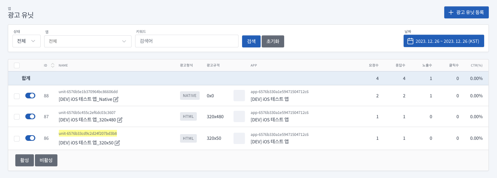

# SANTA SDK for ObjectiveC

ObjectiveC 가이드입니다.  
Swift 가이드는 [README](./README.md)를 참고해주세요.

목차
===

- [시작하기 전에](#시작하기-전에)
  - [SDK 정보](#sdk-정보)
- [시작하기](#시작하기)
- [어플리케이션 설정](#어플리케이션-설정)
  - [Santa SDK 추가하기](#santa-sdk-추가하기-for-cocoapods)
  - [AppDelegate 설정](#appdelegate)
  - [Info.plist 설정](#infoplist-설정)
- [광고 적용하기](#광고-적용하기)
  - [앱 등록](#앱-등록)
  - [유닛 ID 발급](#유닛-ID-발급)
  - [배너 광고](#배너-광고)
  - [전면 광고](#전면-광고)
  - [네이티브 광고](#네이티브-광고)
- [광고 인스턴스 추가 옵션](#광고-인스턴스-추가-옵션)


# 시작하기 전에

- Santa SDK에서는 광고 요청에 대한 응답 후 노출까지의 시간(노출 캐시 시간)을 10분 이내로 권장합니다 (IAB 권장).
- 광고 응답 이후 노출 시간 차이가 해당 시간보다 길어지면 광고 캠페인에 따라서 노출이 무효 처리될 수 있습니다.


# SDK 정보

SantaSDK는 Xcode 15.1, iOS 12.0 버전으로 빌드되었습니다.  

- 참조 1: [App Store 제출을 위한 SDK 최소 요구 사항 보기](https://developer.apple.com/kr/news/upcoming-requirements)   
- 참조 2: [최소 요구 사항 및 지원되는 SDK](https://developer.apple.com/kr/support/xcode)

# 시작하기

## 어플리케이션 설정

### Santa SDK 추가하기 for CocoaPods

**[Cocoapods 설치 가이드](https://guides.cocoapods.org/using/getting-started.html)**

#### POD Install

Podfile 만들기
```
pod init
```
or 
```
vi Podfile
```

Podfile 수정
```
target 'MyApp' do
  use_frameworks!
  
  pod 'SantaSDK'
end
```

Podfile 설치
```
pod install
```

### AppDelegate
```
func application(_ application: UIApplication, didFinishLaunchingWithOptions launchOptions: [UIApplication.LaunchOptionsKey: Any]?) -> Bool {
    ...
        
    // SDK 테스트 설정
    // 앱 배포시 설정을 제거해주세요
    SantaKit.testing = true
    
    ...
}
```

### Info.plist 설정

| Key                                                          | Required | Value                                    | Description                 |
|--------------------------------------------------------------|----------|------------------------------------------|-----------------------------|
| Privacy - Tracking Usage Description                         | 필수       | EX) 맞춤형 광고 제공을 위해 디바이스 식별 데이터를 사용하려 합니다. | 앱이 디바이스 추적 데이터에 액세스 해야하는 이유 |
| App Transport Security Settings<br/> > Allow Arbitrary Loads | 선택       | EX) YES or NO                            | HTTP 프로토콜 임의 로드 여부 설정       |

[//]: # (| Privacy - Location Always and When In Use Usage Description  | 선택       | EX&#41; 맞춤형 광고 제공을 위해 사용자의 위치 데이터를 사용하려 합니다. | 앱이 사용자의 위치정보를 항상 액세스 해야하는 이유    |)

[//]: # (| Privacy - Location When In Use Usage Description             | 선택       | EX&#41; 맞춤형 광고 제공을 위해 사용자의 위치 데이터를 사용하려 합니다. | 앱이 실행중일때 사용자의 위치정보를 액세스 해야하는 이유 |)

[//]: # (| Privacy - Location Default Accuracy Reduced                  | 선택       | EX&#41; YES or NO                            | 앱이 정교한 위치정보를 사용하는지에 대한 값        |)

## 광고 적용하기

### 앱 등록


### 유닛 ID 발급


### 배너 광고

자세한 사항은 배너 광고 샘플을 참고해주세요.  
- [STBannerAdViewController.m](./sample-objc/sample-objc/Controller/STBannerAdViewController.m)

**1. 광고 요청을 위한 변수 선언**  
 
```
// 광고 인스턴스  
@property (nonatomic, strong) STAdView *adView;

// 광고가 표시될 뷰
@property (weak, nonatomic) IBOutlet UIView *adViewContainer;
```

**2. 광고 인스턴스 생성**
```
/**
 * @param adUnitId - 광고 유닛 ID
 * @param size - 원하는 광고 크기입니다.
 */
- (nonnull instancetype)initWithAdUnitId:(NSString * _Nonnull)adUnitId size:(CGSize)size
```

예시)
```
// 광고 인스턴스 생성
self.adView = [[STAdView alloc] initWithAdUnitId:@"adUnitId" size:self.adViewContainer.frame.size];

// 스크린 리사이즈 시 뷰의 리사이즈 여부 설정
self.adView.autoresizingMask = UIViewAutoresizingFlexibleLeftMargin | UIViewAutoresizingFlexibleRightMargin;

// 대리자 전달
self.adView.delegate = self;

// 테스트 여부
self.adView.testing = true;
```

**3. 광고 위치에 광고 뷰 추가**
```
[self.adViewContainer addSubview:self.adView];

// 광고 뷰를 오토레이아웃 설정 (자세한 함수는 샘플코드 참조)
[self setAdViewAutolayoutConstraint:self.adViewContainer mine:self.adView];
```

**4. 광고 요청**
```
[self.adView loadAd];
```


#### 배너광고 Protocol (STAdViewDelegate Protocol Reference)
```
// 광고를 성공적으로로드하면 전송됩니다.
- (void)adViewDidLoadAd:(STAdView *)view;

// 광고로드에 실패 할 때 전송됩니다.
- (void)adViewDidFailToLoadAd:(STAdView *)view;

// 콘텐츠를로드하려고 할 때 전송됩니다.
- (void)willLoadViewForAd:(STAdView *)view;

// 모달 콘텐츠를 닫았을 때 전송되어 애플리케이션에 제어권을 반환합니다.
- (void)didLoadViewForAd:(STAdView *)view;

// 사용자가 광고를 탭하여 애플리케이션에서 나 가려고 할 때 전송됩니다.
- (void)willLeaveApplicationFromAd:(STAdView *)view;
```

### 전면 광고

자세한 사항은 전면 광고 샘플을 참고해주세요.
- [STInterstitialAdViewController.m](./sample-objc/sample-objc/Controller/STInterstitialAdViewController.m)

**1. 전면 광고 요청을 위한 변수 선언**
```
// 전면 광고 인스턴스  
@property (nonatomic, strong) STInterstitialAdView *interstitial;
```

**2. 전면 광고 인스턴스 생성 함수 호출**
```
/**
 * @param adUnitId - 광고 유닛 ID
 */
+ (STInterstitialAdView * _Nonnull)interstitialAdControllerForAdUnitId:(NSString *)adUnitId
```

예시)
```
// 전면 광고 인스턴스 생성
self.interstitial = [STInterstitialAdView interstitialAdControllerForAdUnitId:@"adUnitId"];

// 대리자 전달
self.interstitial.delegate = self;

// 테스트 여부
self.interstitial.testing = YES;
```

**3. 전면 광고 요청**
```
[self.interstitial loadAd];
```

**4. 전면 광고 표시**
```
/**
 * @param controller 전면 광고를 표시하는 데 사용해야하는 UIViewController입니다.
 */
- (void)showFromViewController:(UIViewController *)controller;
```

예시)
```
[self.interstitial showFromViewController:self];
```

#### 전면 광고 Protocol (STInterstitialAdViewDelegate Protocol Reference)
```
// 전면 광고를 성공적으로로드하면 전송됩니다.
- (void)interstitialDidLoadAd:(STInterstitialAdView *)interstitial;

// 광고를로드하지 못할 때 전송됩니다.
- (void)interstitialDidFailToLoadAd:(STInterstitialAdView *)interstitial;

// 전면 광고가 화면에 표시되기 직전에 전송됩니다.
- (void)interstitialWillAppear:(STInterstitialAdView *)interstitial;

// 전면 광고가 화면에 표시된 후에 전송됩니다.
- (void)interstitialDidAppear:(STInterstitialAdView *)interstitial;

// 전면 광고가 화면에 표시되지 못할때
- (void)interstitialDidFailToShow:(STInterstitialAdView *)interstitial;

// 전면 광고가 화면에서 닫히기 직전에 전송됩니다.
- (void)interstitialWillDisappear:(STInterstitialAdView *)interstitial;

// 전면 광고가 화면에서 해제 된 후 전송되어 애플리케이션에 제어권이 반환됩니다.
- (void)interstitialDidDisappear:(STInterstitialAdView *)interstitial;

// 로드된 전면 광고를 더 이상 표시 할 수 없을 때 전송됩니다.
- (void)interstitialDidExpire:(STInterstitialAdView *)interstitial;

// 사용자가 전면 광고를 탭하고 광고가 타겟 작업을 수행하려고 할 때 전송됩니다.
- (void)interstitialDidReceiveTapEvent:(STInterstitialAdView *)interstitial;
```


### 네이티브 광고

자세한 사항은 네이티브 광고 샘플을 참고해주세요.
- [STNativeAdViewController.m](./sample-objc/sample-objc/Controller/STNativeAdViewController.m)

**1. 네이티브 광고 뷰 클래스 선언**  

네이티브 프로토콜을 참고하여 필요한 항목들로 UIView 클래스를 구성한다.  
자세한 사항은 샘플 코드를 참고해주세요.

- [STNativeAdView.m](./sample-objc/sample-objc/Views/STNativeAdView.m)

네이티브 광고 뷰 Protocol (STNativeAdRenderingDelegate Protocol Reference)
```
// 메인 텍스트에 사용하고있는 UILabel을 반환합니다.
- (UILabel *)nativeMainTextLabel

// 제목 텍스트에 사용중인 UILabel을 반환합니다.
- (UILabel * _Nullable)nativeTitleTextLabel

// 아이콘 이미지에 사용중인 UIImageView를 반환합니다.
- (UIImageView * _Nullable)nativeIconImageView

// 메인 이미지에 사용중인 UIImageView를 반환합니다.
- (UIImageView * _Nullable)nativeMainImageView

// 비디오에 사용하는 UIView를 반환합니다. (동영상 광고를 게재할 때만 이를 구현하면 됩니다.)
- (UIView * _Nullable)nativeVideoView

// 클릭 유도 문안 (cta) 텍스트에 사용중인 UILabel을 반환합니다.
- (UILabel * _Nullable)nativeCallToActionTextLabel

// 개인 정보 아이콘에 대해 뷰가 사용중인 UIImageView를 반환합니다.
- (UIImageView * _Nullable)nativePrivacyInformationIconImageView
```

**2. 네이트브 광고 인스턴스 변수 선언**
```
// 네이티브 광고 인스턴스 선언  
@property (nonatomic, strong) STNativeAd *nativeAd;

// 네이티브 광고가 표시될 뷰 선언
@property (weak, nonatomic) IBOutlet UIView *adViewContainer;
```

**3. 네이티브 광고 요청 전처리**
```
+ (void)initNativeAdWithAdUnitIdentifier:(NSString *)identifier :(Class)adViewClass
```

예시)
```
[STNativeAdManager initNativeAdWithAdUnitIdentifier:@"adUnitId" :[STNativeAdView class]];
```

**4. 네이티브 광고 요청 및 표시**
```
[STNativeAdManager startWithCompletionHandler:^(STNativeAdRequest *request, STNativeAd *response, NSError *error) {
    if (error) {
        // 에러 처리
    } else {
        self.nativeAd = response;
        self.nativeAd.delegate = self;
        
        // 네이티브 광고 표시
        [self displayAd];
    }
}];
```
``` 
- (void)displayAd
{    
    // 기존에 표시되던 View들을 제거
    [[self.adViewContainer subviews] makeObjectsPerformSelector:@selector(removeFromSuperview)];
    
    // 광고 위치에 네이티브 광고 뷰 추가 
    UIView *adView = [self.nativeAd retrieveAdViewWithError:nil];
    [self.adViewContainer addSubview:adView];
    adView.frame = self.adViewContainer.bounds;
}
```


## 광고 인스턴스 추가 옵션

- 필요에 따라 광고 인스턴스에 추가 설정이 가능합니다.
  -	`testing` : 테스트 광고 요청 여부.
  -	`keywords` : Custom 메타 데이터를 설정합니다.
  - `coppa` : 미국 아동 온라인 사생활 보호법에 따라 13세 미만의 사용자를 설정하면 개인 정보를 제한하여 광고 입찰 처리됩니다. (IP, Device ID, Geo 정보등)
  -	`rewarded` : 지면의 리워드 여부를 설정합니다.

